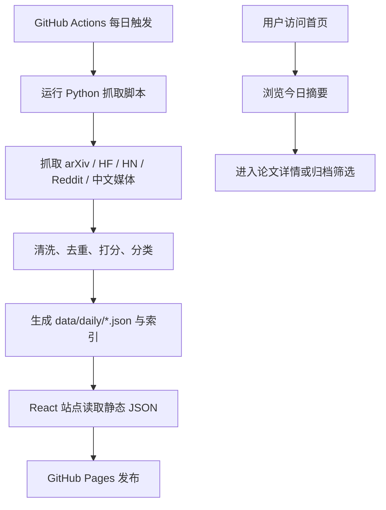

## 1. 产品概述
AI Daily 是一个面向 AI 研究、工程和投资观察的每日行业动态网页，聚合论文、项目、新闻与社区讨论。
- 主要解决多源 AI 信息分散、重复浏览成本高、论文与行业动态缺少同屏上下文的问题。
- 目标用户是 AI 研究员、算法工程师、产品/战略观察者，以及需要每日快速了解 AI 进展的个人用户。

## 2. 核心功能

### 2.1 功能模块
1. **首页 Daily Digest**：日期摘要、统计指标、今日行业动态、热门 AI 项目、精选论文、其他论文列表。
2. **论文详情页**：论文元信息、摘要、标签、来源链接、简短解读、工作参考价值。
3. **归档与分类页**：按日期、来源、主题标签浏览历史内容。
4. **自动抓取工作流**：每天从 arXiv、Hugging Face Daily Papers、Hacker News、Reddit 和中文 AI 媒体抓取并生成站点数据。

### 2.2 页面详情
| 页面名称 | 模块名称 | 功能描述 |
|---|---|---|
| 首页 | 顶部身份区 | 展示站点名、短介绍、最新更新日期和今日内容统计 |
| 首页 | 今日新闻 | 聚合行业动态，展示标题、摘要、标签、来源和原文链接 |
| 首页 | 热门项目 | 展示来自 GitHub/Hacker News/社区的项目卡片，包括星标、简介、技术栈和参考价值 |
| 首页 | 精选论文 | 展示高优先级论文，包括中英文标题、机构、领域、评分、标签和深度解读入口 |
| 首页 | 其他论文 | 以紧凑列表展示更多论文，避免首页过长 |
| 论文详情页 | 论文头部 | 展示论文标题、中文译名、作者/机构、日期、arXiv 分类、来源链接 |
| 论文详情页 | 解读正文 | 展示摘要、核心贡献、方法要点、实验结论、工程参考价值 |
| 归档页 | 日期索引 | 按日期列出每日摘要，支持跳转历史日报 |
| 归档页 | 标签索引 | 按 Agent、RAG、Multimodal、Training、RecSys 等标签筛选 |

### 2.3 数据源范围
| 数据源 | 抓取内容 | 备注 |
|---|---|---|
| arXiv | 最新论文元信息、摘要、分类、作者、链接 | 优先使用 arXiv Atom API |
| Hugging Face Daily Papers | 每日热门论文与热度信息 | 优先解析公开页面或 RSS/接口，失败时降级为空 |
| Hacker News | AI 相关热门讨论、项目、发布帖 | 使用 Algolia HN Search API |
| Reddit | `r/LocalLLaMA`、`r/MachineLearning`、`r/singularity` 等 AI 社区帖子 | 使用公开 JSON endpoint，需限流与 User-Agent |
| 中文 AI 媒体 | 量子位、机器之心、InfoQ AI、智东西、新智元等 RSS/公开页面 | 优先 RSS，避免重度反爬页面 |

### 2.4 内容处理规则
- 去重：按规范化 URL、标题相似度和 arXiv ID 去重。
- 排序：综合发布时间、社区热度、来源可信度和关键词相关性打分。
- 标签：基于标题、摘要和来源关键词生成领域标签。
- 摘要：默认使用规则抽取与原摘要压缩；如配置 LLM API Key，可增强中文总结和“参考价值”段落。
- 失败降级：单一数据源失败不阻断整体日报生成，页面显示已成功抓取的数据源状态。

## 3. 核心流程
用户打开站点后首先阅读当天摘要，再从新闻、项目、论文三个区块快速筛选重点；需要深入时进入论文详情页；需要回看时通过归档页按日期或标签浏览。

## 4. 用户界面设计

### 4.1 设计风格
- 视觉方向：编辑部日报风格，结合研究日志和信息终端的密度感。
- 主色：墨黑 `#12110f`、纸张米白 `#f4efe3`、石墨灰 `#3d3a34`。
- 强调色：信号橙 `#ff6a2a`、青蓝 `#2aa7b8`、荧光黄 `#e8d64f`。
- 字体：标题使用具有报刊感的衬线字体，正文使用高可读中文字体栈，代码与来源标记使用等宽字体。
- 布局：桌面优先，首页采用“左侧摘要栏 + 右侧内容流”的非对称网格；卡片密集但留出清晰层级。
- 动效：页面加载使用轻微错位进入；卡片 hover 时显示来源线和标签浮层；避免过度动画影响阅读。

### 4.2 页面设计概览
| 页面名称 | 模块名称 | UI 元素 |
|---|---|---|
| 首页 | 今日播报 | 大日期、统计数字、数据源状态、更新批次 |
| 首页 | 新闻卡片 | 标题、摘要、来源徽章、标签、原文链接 |
| 首页 | 项目卡片 | 仓库名、星标、语言、简介、参考价值列表 |
| 首页 | 论文卡片 | 中英标题、主题行、机构、评分、标签、详情入口 |
| 论文详情页 | 论文头部 | 大标题、来源按钮、分类、日期、评分 |
| 归档页 | 时间轴 | 日期列表、每日计数、快速跳转 |

### 4.3 响应式
桌面优先；平板下压缩为双栏；手机下变为单栏信息流，顶部摘要区固定为可折叠卡片。所有可点击元素保持足够触控面积，正文行宽控制在可读范围内。
