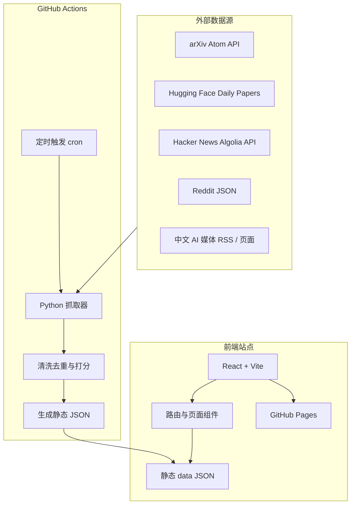
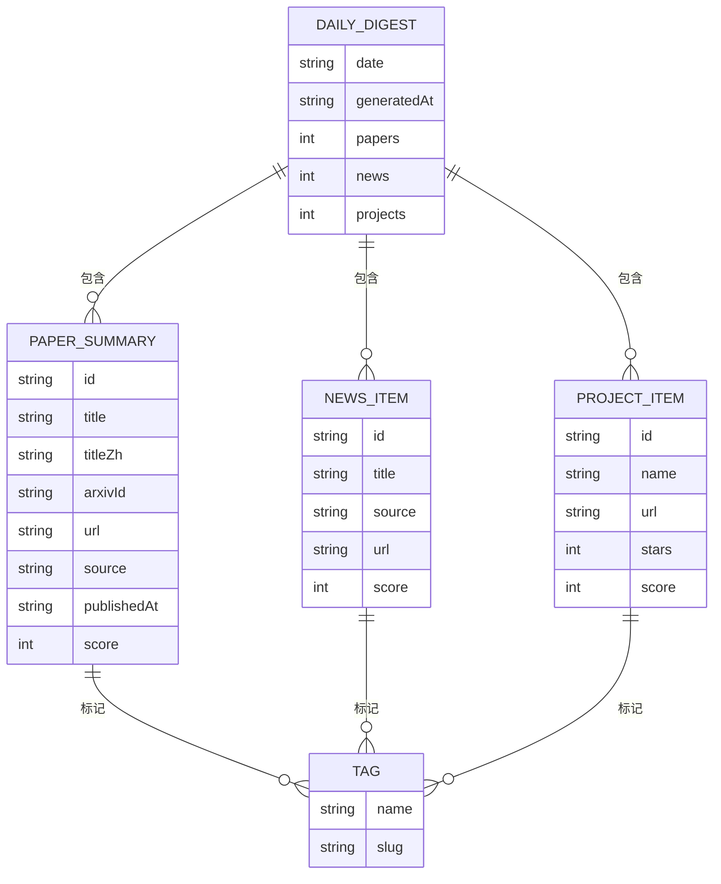

## 1. 架构设计
项目采用“静态前端 + 定时数据生成”的 GitHub Pages 架构。网页运行时不依赖后端服务；GitHub Actions 每天执行抓取脚本，生成 JSON 数据并重新构建发布。



## 2. 技术说明
- 前端：React 18 + TypeScript + Vite。
- 样式：原生 CSS Modules 或全局 CSS 变量，避免引入重型 UI 框架。
- 路由：React Router，支持首页、论文详情、归档、标签筛选。
- 数据生成：Python 3.11，使用 `feedparser`、`httpx`、`beautifulsoup4`、`pydantic`。
- 发布：GitHub Actions 构建 `dist` 并部署到 GitHub Pages。
- 运行策略：每日 UTC 定时任务 + 手动 `workflow_dispatch`。
- 可选增强：如果配置 `OPENAI_API_KEY`、`ARK_API_KEY` 或兼容 OpenAI SDK 的环境变量，则生成更高质量中文摘要；没有 Key 时使用规则摘要。

## 3. 路由定义
| 路由 | 用途 |
|---|---|
| `/` | 今日 Daily Digest 首页 |
| `/paper/:id` | 单篇论文详情页 |
| `/archive` | 历史日报归档 |
| `/tag/:tag` | 标签筛选页 |
| `/source/:source` | 来源筛选页 |

## 4. 数据文件定义
| 文件 | 说明 |
|---|---|
| `public/data/site-index.json` | 最新日期、总计数、可用日期列表、标签索引 |
| `public/data/daily/YYYY-MM-DD.json` | 某日完整日报数据 |
| `public/data/papers/<paper-id>.json` | 单篇论文详情数据 |
| `public/data/sources-status.json` | 最近一次各数据源抓取状态 |

## 5. API 定义
本项目无运行时后端 API，前端通过静态 JSON 读取数据。

```ts
export interface DailyDigest {
  date: string;
  generatedAt: string;
  stats: {
    papers: number;
    news: number;
    projects: number;
    totalItems: number;
  };
  news: NewsItem[];
  projects: ProjectItem[];
  featuredPapers: PaperSummary[];
  otherPapers: PaperSummary[];
  sourceStatus: SourceStatus[];
}

export interface NewsItem {
  id: string;
  title: string;
  summary: string;
  source: string;
  url: string;
  publishedAt?: string;
  tags: string[];
  score: number;
}

export interface ProjectItem {
  id: string;
  name: string;
  url: string;
  summary: string;
  language?: string;
  stars?: number;
  tags: string[];
  takeaways: string[];
  score: number;
}

export interface PaperSummary {
  id: string;
  title: string;
  titleZh?: string;
  url: string;
  arxivId?: string;
  source: string;
  authors: string[];
  institutions: string[];
  categories: string[];
  publishedAt: string;
  summary: string;
  topicLine: string;
  tags: string[];
  score: number;
  takeaways: string[];
}

export interface SourceStatus {
  source: string;
  ok: boolean;
  fetched: number;
  message?: string;
  updatedAt: string;
}
```

## 6. 数据模型



## 7. 抓取与发布流程
1. GitHub Actions 通过 cron 每天触发，也支持手动运行。
2. 安装 Python 依赖，运行 `scripts/fetch_daily.py`。
3. 抓取器按数据源并发请求，统一转为内部 `RawItem`。
4. 处理器执行去重、关键词过滤、分类、评分和摘要生成。
5. 写入 `public/data` 下的日报、索引、论文详情和状态文件。
6. 安装前端依赖并运行 `npm run build`。
7. 使用 GitHub Pages action 发布 `dist`。

## 8. 工程边界与风险
- Reddit 与部分中文媒体可能触发限流或反爬，需设置 User-Agent、超时、重试和失败降级。
- Hugging Face Daily Papers 页面结构可能变化，抓取逻辑需保持宽松解析。
- 中文媒体优先 RSS；不做登录态、付费墙和侵入式抓取。
- 自动摘要默认不依赖 LLM，避免 secrets 缺失导致工作流失败。
- GitHub Pages 是静态托管，不适合运行时搜索后端；全文搜索可在前端基于索引 JSON 实现。
